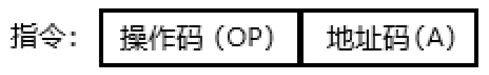
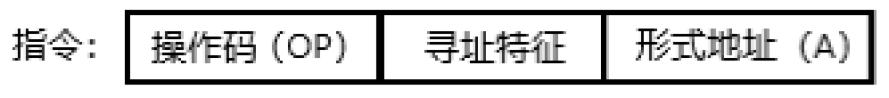
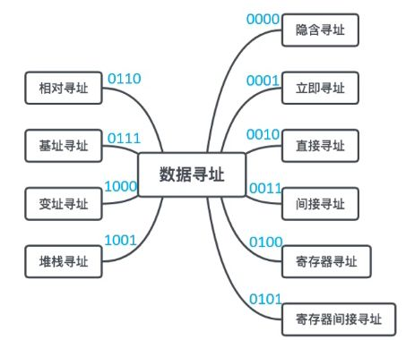
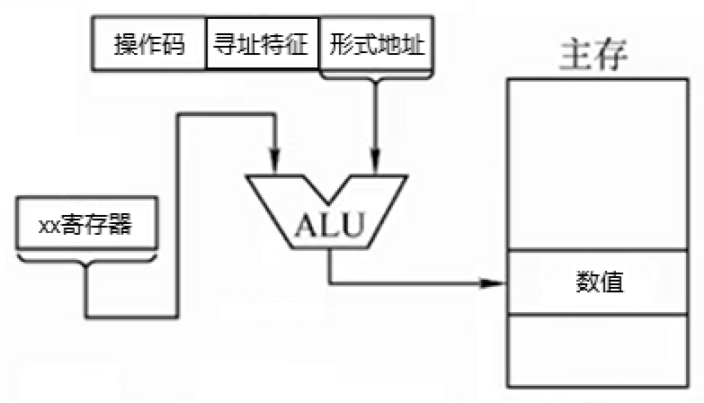

如何告诉计算机它应该做什么？

首先，计算机只认识电信号，而人们把低电平和高电平抽象成了0和1的数字——机器码。

在计算机的初期，人们就意识到：如果只有0和1的可供输入来代表高低电平，作为人类实在是太难写了，需要在旁边看着参照表输入。所以人们发明了汇编语言及其对应的汇编器（类似参照表），只要输入几个简单的字母，类似LDR（读），STR（写），ADD（加），汇编器就能把这些字符的电信号转换成机器码——也就是汇编语言到机器语言的过程。

但是汇编语言还是很麻烦：例如我要做一个加法，要先读取一个数值，再读取另一个数值，两个相加得出答案，把答案再写回去...

后来人们发明了高级语言，以上那么多的步骤可以直接简化为$a+b=c$。只要把这个式子扔给对应的编译器，编译器就能把这些字符先转换成汇编语言，汇编器再转换成机器码（有些编译器支持直接转成机器码）。

每一次敲击键盘，其实都是在输入一次电信号——屏幕上显示的可读字符只是计算机通过“一系列的操作”，把电信号转换来提供给你看的，它们本质上还是各种高低电平。 

编译器和汇编器的操作就是把这些对计算机无意义的电信号转换成对计算机有意义的电信号。

那怎样的电信号才是有意义的呢？

**指令集**就是那些有意义的电信号的合集，其中每个指令对应着一个电路——你给电路输入一些电信号，它就会返回一些电信号——意味着硬件电路是根据指令集来设计的。

指令集可以被分为两类：

- 复杂指令集CISC（Complex Instruction Set Computer）
- 精简指令集RISC（Reduced Instruction Set Computing）

CISC把能用上的电路都用上，一条指令就可以实现一个复杂的功能。例如用一个复杂的电路实现矩阵的乘法，只要给输入就能直接给输出。

RISC中的一条指令大多是“基本指令”，它是通过多条指令组合完成一个复杂的功能。同样是计算矩阵的乘法，它需要用到多个整数的加减乘的指令，通过一定的顺序执行得到输出。

一条**指令**由**操作码**和若干个**地址码**组成。

- 操作码告诉计算机要做什么：是去取/存一个数字，还是把两个数字相加、相减、相乘之类的计算动作。
- 地址码告诉计算机是对谁进行操作：你要取/存/算的那（几）个数字的地址是XXX…

指令可以根据操作码的长度、地址码数目、操作类型进行分类。

按照地址码的数目分类：

- 零地址指令：没有地址，适用于不需要操作数的指令，例如停机指令。
- 一地址指令：有一个地址，只对一个地址里的数字进行操作，例如对一个数字加一、取反、求补。
- 二地址指令：有两个地址，对两个地址里数字进行操作，例如两个数字相加、相减。
- 三地址指令：有三个地址，对前两个地址的数字进行操作，把他们两的计算结果放在第三个地址里。
- 四地址指令：有四个地址，它包含了和三地址一样的功能，第四个地址可以用来告诉计算机下一条将要执行指令的地址。

指令本身也是数据，它也是被存储在主存中的，所以想要执行一条指令就要知道这条指令的地址在哪。

CPU中有一个**PC**寄存器（Program Counter，程序计数器），它用来记录当前计算机所执行的指令的地址。每当CPU从PC那拿了一条指令的地址，PC中的地址就会自动加“1”[^1]，跳转到下一个指令的地址，而此时CPU是拿着PC刚刚所给的地址获取指令。

自动加“1”便是**顺序寻址**。

而有些时候我们需要更改PC存储的指令地址，让CPU先执行该指令——这是**跳跃寻址**。

顺序寻址和跳跃寻址都属于**指令寻址**，因为他们都是直接给出地址，相当于直接告诉计算机“你去地址5找数据”。

但是指令寻址太过死板，不会“变通”：

- 如果告诉计算机的地址不是5，而是一个比5大得多的数，地址码装不下怎么办？
- 地址5是相对于地址0来说的，而一段程序中的指令位置会随着程序的移动而移动。意味着如果该程序的起始指令地址变动为了100，那么你应该要找的地址是105而不是5。
- 指令和数据如果都存储在主存中，那么每次读取都要经过主存。可以把部分数据放在速度更快的寄存器中，以此来提升速度吗？

**数据寻址**可以解决以上问题。

数据寻址的指令格式由**操作码、寻址特征、形式地址**构成。

寻址特征类似“函数”，CPU只要把形式地址经过“函数”计算一下，就能得出**有效地址**。

以下列出十种数据寻址。由于只有十种，所以可以用四位二进制来表示不同的寻址特征，计算机看到这四位二进制便能知道要做怎样的操作：

- **立即寻址**：准确的说它并没有在寻址，而是把实际要操作的数据放在了形式地址中。
- **隐含寻址**：加法计算需要两个数值相加，但这时计算机只给出了一个数值地址。在没有另一个数值地址的情况下，计算机会去一些默认的地方——例如累加寄存器（AC）中寻找另一个数值，这样就节省了一个地址的长度。
- **直接寻址**：顾名思义，直接提供数值地址。
- **间接寻址**：通过形式地址在主存中找到的数值还是一个地址——地址的地址，于是又去主存中找。由于主存所能存储的空间比单条指令要长的多，所以可以表示更大的范围，找到更远的数。[^2]
- **寄存器寻址**：形式地址指向的是某个寄存器的地址。
- **寄存器间接寻址**：与间接寻址相同，通过形式地址在寄存器中找到的数值还是一个地址，于是又去主存中找。

以下三种数据寻址方式属于数据寻址中的**偏移寻址**：偏移寻址的特点在于，都是基于一个**基地址**加上**偏移量**来得到有效地址。单是形式地址所提供的地址不够计算，需要额外的专用寄存器来帮忙。

例如一个程序的初始地址为100，代码在程序中的次序为5，那么该指令的有效地址为105

- **基址寻址**会在形式地址中给出5，**BR**寄存器（base address register）会给出100，然后ALU计算出105。
- **变址寻址**会在形式地址中给出100，**IX**寄存器（index register）会给出5，然后ALU计算出105。
- **相对寻址**会在形式地址中给出5，**PC**寄存器给出100，然后ALU计算出105。

他们有什么不同？这样倒来倒去有什么意义？

主要原因在于程序，或者程序中的代码会频繁变动，我们需要把其中频繁变动的变量，放在专属的寄存器中便于改动。

- 如果一个程序在主存中的位置频繁改变，那我们就应该把频繁改变的初始地址放在BR寄存器内修改——基址寻址。
- 如果一个代码在程序中的位置频繁改变[^3]，那我们就应该把频繁改变的偏移量放在IX寄存器内修改——变址寻址。

如果这两个条件都占呢？——**基址与变址复合寻址**。

至于相对寻址，它是基址寻址的“变种”。它的基地址是当前指令的地址，根据形式地址给出的偏移量，PC可以直接跳到有效地址让计算机执行指令。

还有最后一种数据寻址——**堆栈寻址**。

简单来说就是用一个先入后出的栈往里面放地址，栈顶始终由**SP**寄存器来控制。当你想要拿地址或存地址时，只需要告诉计算机从SP那拿地址——至于SP怎么移动那是SP的事，不用给具体地址（很像隐含寻址）。

通过发出以上不同格式的指令，我们可以从多个角度、多个方面告诉计算机应该做什么事情，但是计算机又是如何将这些指令一步步落实的呢？

[^1]:这里的“1”指的是1个指令的宽度，而并非数值1
[^2]:多次间接寻址是在一次间接寻址的基础上，再进行间接寻址。
[^3]:考虑对一个数组进行循环相加，我们只要将IX里的值不断加1，即可不断往后取到数组内的数值

