CPU就像计算机的大脑，它负责接受人们发给它的指令，并配合存储器完成相应的工作。

CPU分为**运算器**与**控制器**两个部分：

运算器是专门干活的，由算术逻辑单元ALU与各种寄存器所组成的。

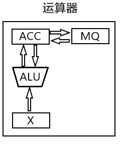

寄存器就像做题时的草稿纸，是辅助ALU计算的。例如累加寄存器可以存放一次计算结果，在下次一次计算时，可以将前一个计算的结果取出相加，达到累加的效果；乘商寄存器MQ也是如此，x乘以n等于把n个x相加，MQ会记下每次的结果以备下次计算；通用寄存器X顾名思义，它会去任何需要它的地方，比如为ALU提供初始计算值。

控制器是专门分配任务的，由控制单元CU与主要的两个寄存器IR，PC组成。

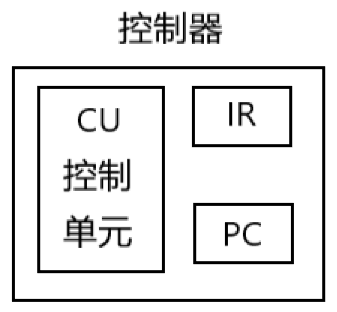

- PC记录了当前指令存放在内存中的地址。

- IR记录了当前CPU要执行的指令。

- CU根据指令发出相应的控制信号。

CPU获取一条指令的流程是这样的：

1. CPU从PC中拿到指令的地址，并放入存储器的MAR，PC自动加“1”。
2. 存储器通过MAR的地址，拿出相应数据放入MDR。
3. CPU将MDR的数据放进IR。

而CU在幕后操纵着一切——CU通过电信号，打开PC的输出线路和MAR的输入线路，才让地址从PC流入MAR；向内存发出读信号，并打开MAR的输出和MDR的输入，让相应地址的指令数据流入MDR；最后再打开MDR的输出，IR的输入，把指令数据转移回IR。

CU正是用电信号，打开/关闭一个个寄存器的输入/输出线路，来实现CPU内数据的流通。

CU控制着数据的流动，但前提是CPU内的部件都要先连接在一起，这样CU才能控制它们。

很自然的，我们可以把所有部件简单粗暴的用线直接连在一起：例如运算器内部的ALU需要两个输入，那么就让每个寄存器都引出两个输出线分别接上。

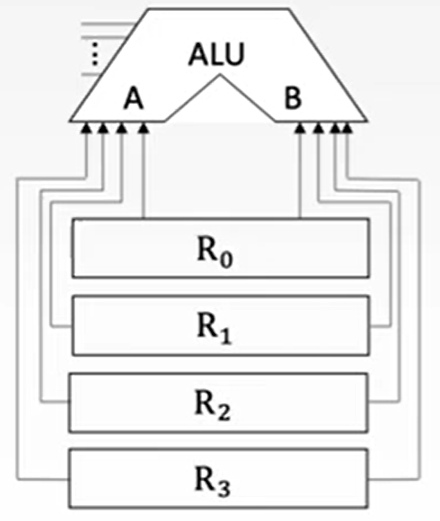

为了控制哪个寄存器的数据可以流向ALU，可以在每根线上加上一个三态门，它的作用是控制每根线是否可以输出。

我们还可以在ALU的两个输入前，各加上一个多路选择器（MUX），它可以从多条线中选一条输出。

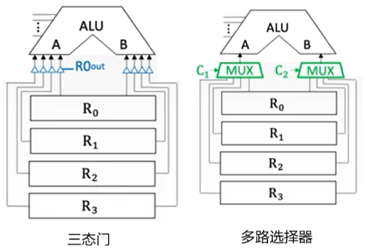

以上连接的方法都称为**专用数据通路方式**。

更常用的是**单总线方式**——所有部件都直接或间接的连接到总线，传输的时候只要收到信号就把数据扔进总线，其余的不管。

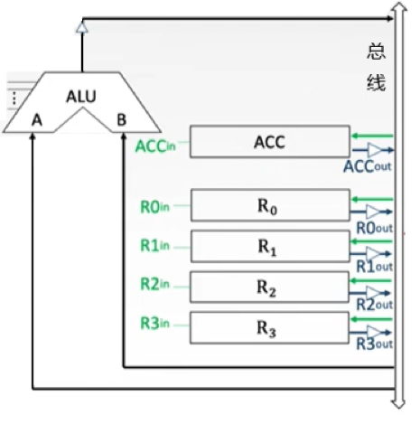

但这样做有个很明显的弊端——两个寄存器不能同时输入，否则数据就会冲突，解决的办法是在ALU的其中一端加上一个暂存寄存器。

例如ALU需要R~0~与R~1~寄存器的数据，打开R~0~的输出与暂存寄存器的输入，就可以将R~0~的数据存在暂存寄存器中，之后再同时打开寄存器与R~1~的输出，这样就保证了ALU数据的同时输入。

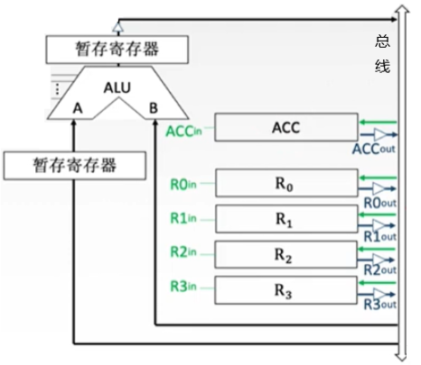

ALU的输出端也需要一个暂存寄存器来连接。可以引入存储器章节中对寄存器的比喻：数据相当于水，寄存器相当于蓄水池，ALU与数据线都是水渠，只不过ALU是个可以改变水流的复杂水渠。当你打开R~1~与暂存寄存器的“闸门”，让水经过ALU计算后，水会流出ALU的另一端。而ALU的输出如果直接流向总线，就会污染总线上的水，进而污染R~1~的输出干扰到计算，所以需要另一个蓄水池拦住还未处理完成的水。

另一侧的控制器也用单总线的方式连接：

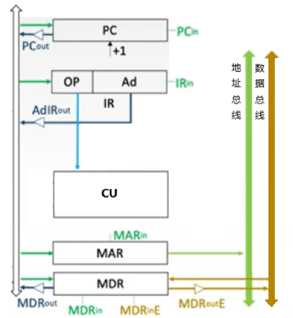

控制器将主存中的MAR与MDR集成了进来，变成了控制器内部的组件。我们可以引入地址总线与数据总线，让其与存储器保持连接，这样可以更高效的访问存储器。

至此，一个CPU通过单总线的方式搭建了起来：

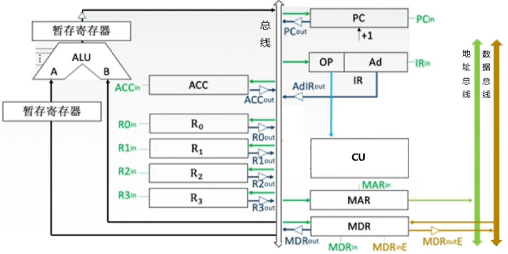

你其实也可以用多条总线来缓解单条总线的尴尬——每条总线只能同时传输一个数据，多几条就能同时多传输几个。而这种方式称为多总线方式，原理和单总线一样。

那么CU是如何指挥CPU的其他部件来执行一条指令呢？

指令起初是被存储在内存中的，所以想要CPU执行指令，就需要先把指令读取到CPU内部——完成这个操作的时间称为**取指周期**。

而如果取到的地址是形式地址而不是有效地址，我们还需要把它变为有效地址之后再取到真正的指令——这段时间称为**间指周期**。

取到指令后就该执行该指令了——执行的时间称为**执行周期**。

执行结束后，正常情况下是继续执行下一条指令。但如果你此时做了一些突发操作，例如点鼠标、敲键盘，那么就应该先执行这些操作，等结束后再回到正常流程——处理这段突发操作的时间称为**中断周期**。

把以上所有周期的时间加起来就称为**指令周期**，只不过有些指令没有间指周期或者中断周期。

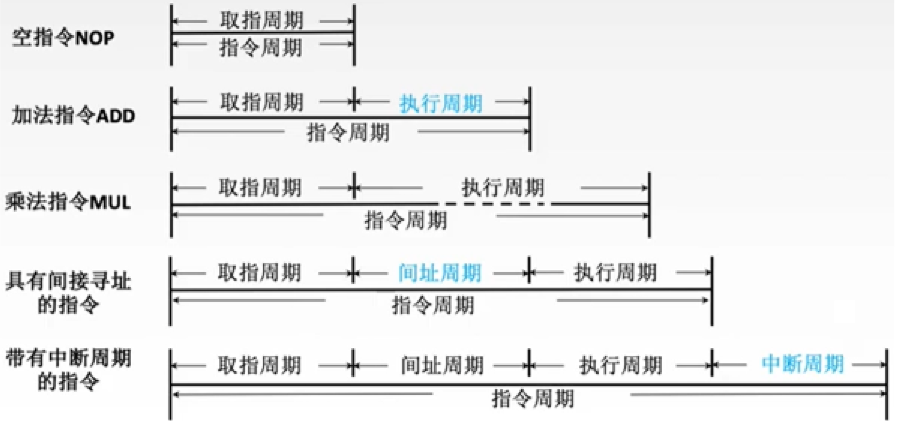

控制单元CU中有四个寄存器FE、IND、EX、INT分别对应了取指/间接/执行/中断周期，哪个寄存器“亮着”，cu就知道当前处在哪个周期。

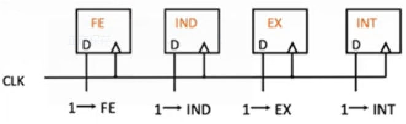

那么CU在取指/间接/执行/中断周期内，要做哪些操作才能达到取指/间接/执行/中断效果呢？

一条指令其实是被层层分解成“最小执行单位”，然后通过执行这些“最小单位”来完成的——就像一条高级语言代码对应多条指令一般。

还是拿一条指令中的取指操作举例，该操作有三个步骤：

- 将放在pc寄存器中的指令地址放进MAR中。

- 向存储器发送一个读信号，使得存储器把MAR中的地址的数据放进MDR。

- 将MDR内的数据（指令）放进IR寄存器，完成取指。

这每一步都称为**微操作**，这些微操作都是由CU发出**微命令**来控制的。

每一个周期的操作，都是由一个个微操作所组成的，不同周期的操作对应着多个不同的微操作。

光有操作没有次序是无法执行指令的，举个例子：一个产品有多道工序，每个工序由一个工人负责。一个工人完成一道工序后要告诉下一位工人他已经完成了，下一个工人才开始他的工作——你不能等他没做完就拿来。如果有**时钟**，工人就会知道三秒之后他就要干活了——而上一个工人必须保证在三秒内干完，时钟的存在省去了“告诉”这一步骤。[^1]

CPU中的时钟叫晶体振荡器，它可以产生稳定频率的时钟脉冲，也就是在高、低电平之间来回切换。

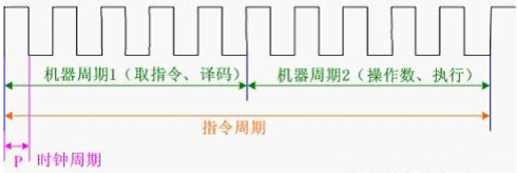

- 一个**时钟周期**完成一次微操作，多个时钟周期组成一个机器周期。

- 一个**机器周期**完成一个指令阶段，多个机器周期组成一个指令周期。

- 一个**指令周期**完成一个指令。[^2]

执行一个指令，其实就是完成不同周期内的多个微操作，那么CU是如何实现这些微操作的呢？

[^1]:“告诉”这一动作其实是握手，也就是不用时钟的异步电路，采用时钟来协调的是同步电路。
[^2]:时钟周期又被成为“震荡周期”或“节拍脉冲”。机器周期也被称为“CPU周期”