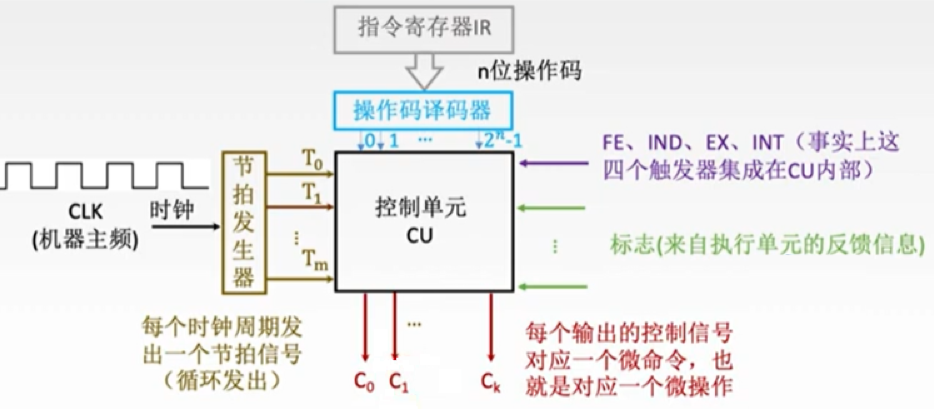
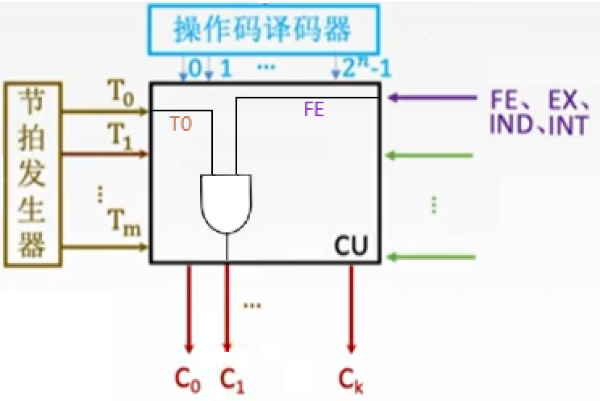
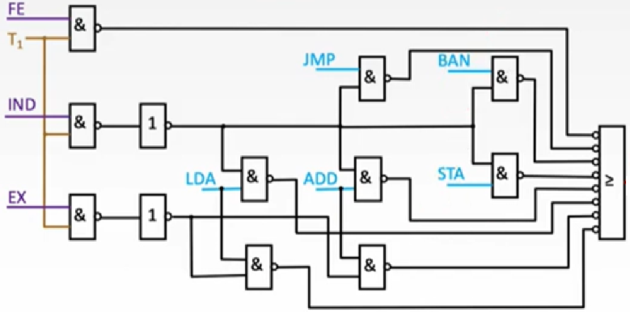
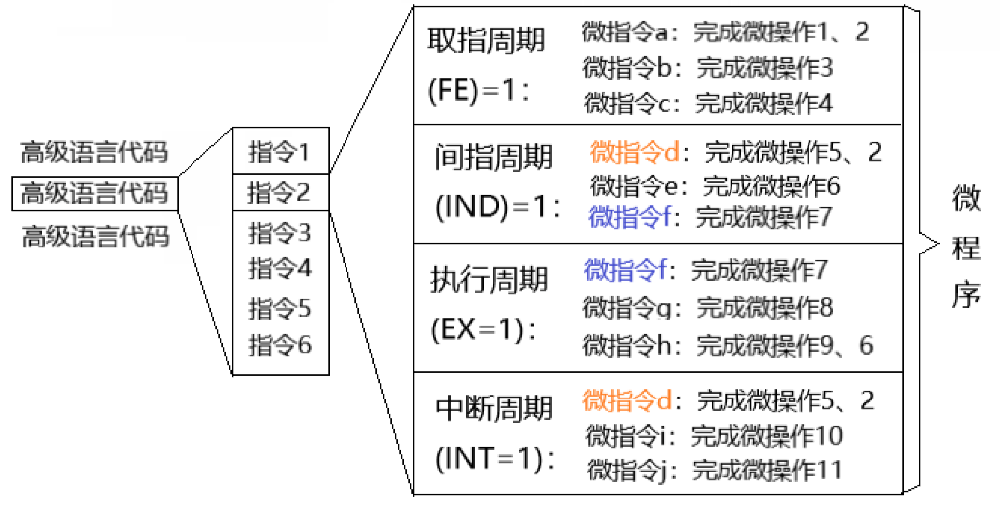
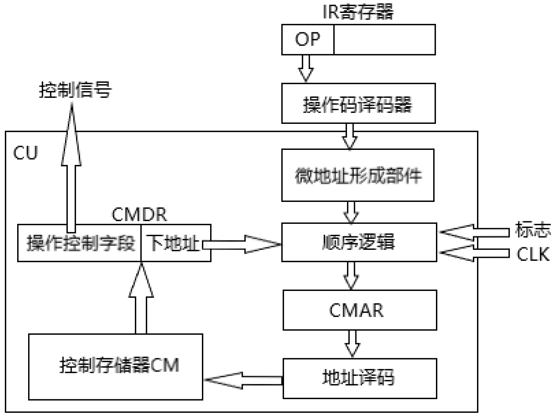
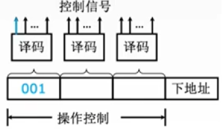
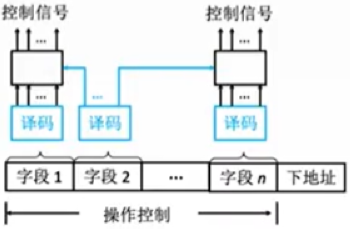
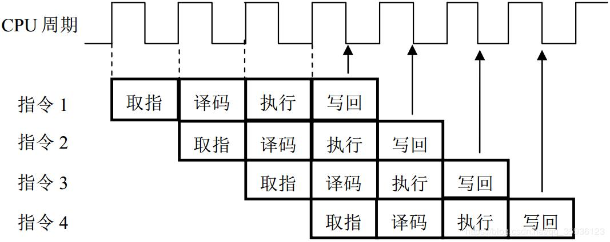
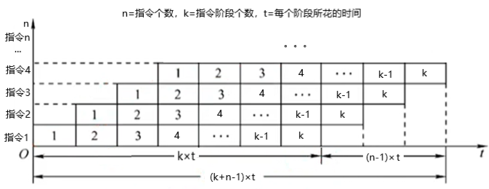

一个控制单元CU的作用就是接收指令，指挥执行。

CU所接收的输入有三个：节拍发生器、操作译码器、标志

- **节拍发生器**：时钟会给节拍发生器发出一定频率的时钟脉冲，节拍发生器根据时钟脉冲的次数，向CU循环发送节拍信号。如果规定每个机器周期中包含十二个时钟周期，那么当节拍发生器收到第十三个时钟脉冲时，它会重新发出节拍信号“1”。而CU也会根据此节拍信号进入下一个机器周期——CU会“点亮”FE、IND、EX、INT四个寄存器中的一个，表示当前整体处在哪个机器周期[^1]。
- **操作译码器**：寄存器IR会将指令中的n位二进制操作码发送给操作译码器——n位二进制对应着2^n^种状态，译码器需要与CU连接2^n^根线，每一种状态对应一根线，使得CU可以识别该操作码。
- **标志**：标志是接收反馈的信号——经过ALU处理后的数字是正数还是负数、数字有没有溢出、鼠标有没有点击、哪个键盘敲击了等等，都是反馈信号。

CU接收这三个外部参数后，就能够发出控制信号——**微命令**，来指挥CPU做出微操作。

CU是如何将这三个输入转换成输出的呢？

根据CU的构造，可以分为**硬布线**与**微程序**两种转换方式：

**硬布线控制器**内部是各种组合逻辑电路：

例如想要完成一个$(PC)\rightarrow MAR$[^2]的微操作，就需要一个与门，其两个输入为*取指周期信号*与*节拍信号“1”*。如果当前正好处在这一情况，该与门就会输出信号1，将该输出接到PC~out~、MAR~in~，[^3]就能完成该微操作。

每需要完成一种微操作，CU就需要再加上一个组合逻辑电路。虽然执行的很快，但是设计起来十分复杂。

**微程序控制器**的思路是用软件替换硬件。这样做的好处是不用设计复杂的电路，但缺点是运行的速度比较慢。

就像一行代码对应多个指令一样，在微程序控制器中一个指令对应多个**微指令**，而一个微指令对应一个或几个**微操作**——此时一个指令也对应着一个**微程序**，一个微程序包含多个微指令。

每个微指令就像指令一样，人们预先写好保存起来供计算机调用。

如同一个指令存储在主存中，一个微指令存储在**控制存储器CM**中（ Control Memory），原先存储器内的MAR、MDR在CM中变成了**CMAR、CMDR**。

- 当CU接收到指令中的操作码时，**微地址形成部件**会产生该指令的微程序的*初始位地址和后续地址*。
- 接下来的**顺序逻辑电路**会根据微地址形成部件的信息，生成微程序中某一条微指令的地址，且在生成的过程中受到标志与时钟的影响，可能会改变当前所要发送的微指令地址。
- 顺序逻辑电路确定好要执行的微指令地址后交给CMAR，CMAR通过地址译码器选择CM中的微指令传输给CMDR。

CMDR中的一个微指令包含**操作控制字段**与**下地址**两个部分：

- 操作控制字段是一个微指令执行一个或几个微操作所需要的信号，
- 下地址指明了下一个微指令的地址，它的输出连接顺序逻辑，一同参与顺序逻辑决定下个微指令地址的决策过程。

而一个微指令中的操作控制信号是怎么完成一个个微操作的呢？

每一个操作控制字段都是一串二进制数，每个二进制数都对应着一个微操作。譬如将其中一位二进制的输出线连接到PC~out~、MAR~in~，当该位为1时，就会输出信号并打开这两个开关，完成$(PC)\rightarrow MAR$的微操作——这是**直接编码方式**。

把一串二进制数分段，例如将九位数的二进制分成三段，每段的三位数用一个译码器将它转换成2^3^种状态，这样一个微指令就能表示更多的微操作——这是**字段直接编码方式**，因为经过一层译码器的转换，会比直接编码来的慢。不过要注意，需要留出一个状态来表示不作操作，这个状态通常是多个零。

在一层译码器的基础上再加上一层译码器可以表示更多的状态，意味着一个微指令的控制字段可以变得非常短，但缺点是会变得更慢——这种**字段间接编码方式**也称为隐式编码。

微指令中的下地址字段，可以通过多种方式形成：

- 可以将微指令中的下地址直接拿来用。
- 像PC+“1”那样，CMAR自动帮你加一指向下一微指令地址。
- 指令当中的操作码可以包含下一个微指令的地址。
- 有些微指令类似JUMP指令，是根据判断当前的条件来选择下一个微指令地址。

用以上编码方式的微指令称为**水平型微指令**，它能够在一条微指令中执行多个*并行*的微操作。

还有两种编码方式的指令：

- 垂直型微指令：一条垂直型微指令只能执行一个微操作。与水平型微指令相比，它的长度更短、更简单，容易编译。但是由它所组成的微程序长度更长，运行比较慢。
- 混合型微指令：融合以上两种指令，各取所长。

一个指令被CPU中的PC选取并读取到IR（取指），再从IR转送给CU（译码），最后从CU发出微操作（执行），实现一条指令的执行。

一条指令从开始到结束，需要多个部件协同工作，依次处理。

如果只有一条指令需要执行，那就意味着在同一时间内只有一个部件在工作，其余的部件都在休息。

**流水线**的作用就是充分利用空闲的部件让效率最大化。

- 兔子A把面团分成剂子
- 兔子B在按剂子的时候兔子A分第二个
- 兔子C在弄馅的时候兔子B在按第二个兔子A在分第三个...

再看这张图的时候是不是亲切多了：

一共有n条指令，每个指令有k个执行阶段，每个执行阶段平均耗时t，求总时间T ：
$$
顺序执行：T=n*k*t
$$

$$
流水线执行：T=k*t+(n-1)*t=(k+n-1)*t
$$

我们用吞吐率TP衡量流水线的性能：
$$
吞吐率=\frac{执行条数}{总时间}
$$

$$
TP=\frac{n}{(k+n-1)*t}
$$

以上讨论的流水线都是理想中的情况——层层叠加，环环相扣。但现实中可能会因为种种原因被打断：

- **资源冲突**：假设指令1的第三步与指令3的第一步都要访问内存，那么他们会同时对存储器进行操作，从而产生冲突。可以将指令3暂停一个周期，与指令1错开。而如果指令1的访存是访问数据，指令3的访存是访问指令，那么对于存储器来说可以将数据与指令分开存放，这样指令1和指令3就可以同时访存了——这种方法是**资源重配置**。
- **数据冲突**：假设指令1在第三步用ALU做加法，第四步把结果写进寄存器。但是指令2在第二步就要从寄存器中拿结果，第三步要把结果扔进ALU继续算——肯定是错的，因为指令1还没把结果写进寄存器指令2就拿了。除了一直暂停到指令1写进寄存器，还可以用**数据旁路**的方法——跳过对寄存器的存取，直接将ALU的输出当作输入继续计算。
- **控制相关**：原本按照顺序执行的指令，可能会因为某个判断条件而跳过——类似if/else执行不同的指令，另一半原先排好顺序的指令就会被遗弃。**分支预测**可以猜哪边是对的，从而一开始就按照正确的顺序将指令排好，现在的分支预测正确率有90%以上。

[^1]:一个机器周期内有固定数量的时钟周期是定长机器周期，数量不固定的是不定长机器周期。
[^2]:PC是一个寄存器，$(PC)$表示将寄存器的内部数据拿出，$(PC)\rightarrow MAR$表示将数据放到MAR。
[^3]:PC~out~指的是PC寄存器的输出信息号线，MAR~in~是MAR的输入信号线。

