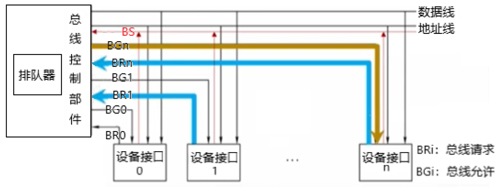

把电脑挡板拆开，就能看到一块板子上插着各种电脑部件——CPU，内存条，硬盘，显卡之类的。

如果仔细看这块板子，你会发现上面有许多线路将这些部件连接在了一起。

**总线**（bus）就是一根连接很多部件的**公共通信干线**。就像它的英文名一般，是用来运输数据的。

一根总线，其内部可以有多根信号线：

- **串行总线**：只有一根信号线，一次只能传送少量数据。发送方需要将数据从“大块”拆解成“小块”发送，接收方再将“小块”拼装成“大块”。
- **并行总线**：内部有多根信号线，发送双方不需要拆解拼装过程，方便传输。但是信号线数量多，远距离成本高，而且当它们工作频率较高时，多条传输线有可能会互相干扰。

根据计算机的层级与传输的信息不同，可以划分出不同功能的总线。

- **片内总线**：部件内部的总线，比如运算器内部ALU与各个寄存器、寄存器与寄存器的公共连线。
- **系统总线**：部件与部件之间的总线，一根系统总线内部包含以下信号线：
  - 数据总线：用来传送部件之间的数据。
  - 地址总线：用来传送目标数据所处在的位置。
  - 控制总线：用来发出控制信号，以及接受反馈信号。
- **通信总线**：计算机与计算机间的信息传送，比如网络通信。

总线由于承担了多个部件间的数据传输，所以在同一时刻只能允许一个设备将数据传输给总线，否则数据会混乱。

那如果多个部件同时需要数据传输，总线应该让哪个部件优先传输呢？

总线通过**仲裁**可以实现对设备传输数据的次序的安排，有**集中仲裁**与**分布仲裁**两种方式。同样是老大（总线控制器）分给小弟（设备）吃东西，集中仲裁是看老大怎么分配；分布仲裁是让小弟都打一架，谁赢给谁吃。

为了接收小弟想吃东西的信号与发送老大分配给谁的信号，总线控制器延伸出了**总线允许BG、总线请求BR、总线忙BS**三种信号线，每个设备都与这些信号线相连接。

集中仲裁的分配方法有三种：

**链式查询**：这种方式类似小弟按顺序坐一排，老大每次都会从左往右的问小弟要不要吃东西。如果第一个小弟一直说想吃，那就轮不到第二个。

硬件的设计思路是：BG不同于其他信号线，它会穿过每个设备，让设备判断自己是否需要用总线。

当有设备想用总线时，会往BR发送信号，总线控制器收到信号后会发送BG信号。如果有两个设备同时请求，那么次序靠前的会优先收到BG信号，并对其进行拦截。同时它还往BS发送信号，当总线控制器收到BS信号后，就不再理会是否有设备请求使用总线了。直到该设备用完总线后，撤销BS信号。

链式查询无法改变设备的优先级，所以很不灵活。

**计数器查询**：老大给二号小弟吃完之后从三号小弟开始问起，循环询问。

硬件的设计思路是：少了一根BG信号线，多了一组设备地址信号线[^1]，可以往总线控制器里发送设备地址，例如设备1、设备2。总线控制器内部有个计数器，它可以记录上次谁用过总线。

设备3往BR发送请求信号，总线控制器收到后信号后，就像拿着个大喇叭问每个设备——设备1要用吗？没人回应就在本子上记下设备1，然后接着喊——设备2要用吗？没人回应继续记下设备2，叫设备3。设备3听到控制器叫自己，于是往BS信号线发送信号。总线控制器收到后记下设备3，停止询问。等到设备3撤销BS信号后，下次总线控制器从设备4开始喊...

但如果每次总线控制器收到BS信号后，将计数器清零，那么效果就和链式查询一样了。

**独立请求**：每个设备都与总线控制器有单独连接的BR、BG信号线，这样设备可以单独向控制器发送BR信号，也可以单独收到控制器的BG信号。总线控制器内部有个排队器，用来处理每个设备的次序。

采用独立请求的方式，会让总线的仲裁更加灵活，但缺点是线路多，而且总线控制器会设计的比较复杂。

当一个主设备申请到总线的使用权后，它是如何与另一个从设备传输数据呢？

我们将两个设备从申请到结束的过程称作**总线周期**，一个总线周期内有四个阶段：

- 申请分配阶段：主设备向总线控制器发送请求，并获得总线使用权。
- 寻址阶段：主设备通过总线，发出要访问的从设备的地址以及有关命令，将从设备启动。
- 传输阶段：主设备与从设备传输信息。
- 结束阶段：主设备撤回在总线上的信息，让出总线使用权。

**总线定时**是在一个总线周期内，两个设备传输数据时所需要遵守的传输协议，分为**同步定时**与**异步定时**两种协议。

同步定时：主设备与从设备根据统一的时钟信号，做出相应的操作。

- T1：主设备在T1的上升沿时刻，向地址发出地址信息。
- T2：主设备在T2的上升沿时刻，发出读/写命令。
- T3：从设备在T3时钟周期内，将数据传到总线上。
- T4：主设备在T4的上升沿时刻，撤销读/写命令，从设备不再发送数据。

同步通信最大的问题在于时间是固定的，如果从设备无法在一个固定的时间内发送完数据就会造成数据丢失。

异步定时不需要时钟来进行同步协调，但是需要设备间的信息确认——类似两个人之间的交流，分为不互锁，半互锁，全互锁三种方式：

不互锁速度快，但是可靠性差——数据丢半路了都不知道。全互锁速度慢，但是可靠性好。

[^1]:是一组信号线而不是一根，因为表示设备地址需要多个比特。