**IO（Input/Output）设备**是将数据输入计算机或接收计算机输出的设备。

鼠标、键盘都属于IO设备，它们所连接到的电脑的接口叫做**IO接口**（或称为IO控制器）。

IO接口为了能够充当设备与计算机的桥梁，他需要多个寄存器：

- **数据寄存器**：保存设备的输出或计算机的输出。
- **控制寄存器**：计算机需要控制设备做出操作，要做的操作存在这里。
- **状态寄存器**：设备完成操作后，需要告诉计算机当前的状态。

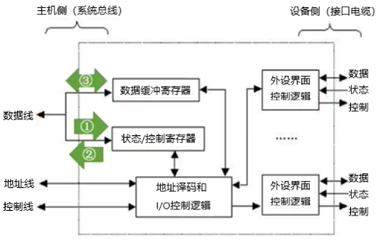

计算机可以通过控制寄存器告诉设备要做什么；设备可以通过状态寄存器反应当前是否准备就绪；计算机通过状态寄存器来决定是否要往数据寄存器里存取数据。

你会发现该流程中控制寄存器只在计算机发送命令时有用，当IO接口收到命令后该寄存器就无用了。所以我们可以将状态寄存器与之合并，节约空间与成本。

一个IO接口可以对应多个设备，每个设备可以有自己的一组数据、控制、状态寄存器，这样计算机就可以通过控制不同组的寄存器，来控制不同的设备。

这些寄存器对于计算机而言都是**IO端口**——数据端口、状态端口、控制端口。

那么计算机又是如何与IO接口连接呢？

一种显而易见的办法：拉一条系统总线出来，CPU、主存、IO接口都连在上面。

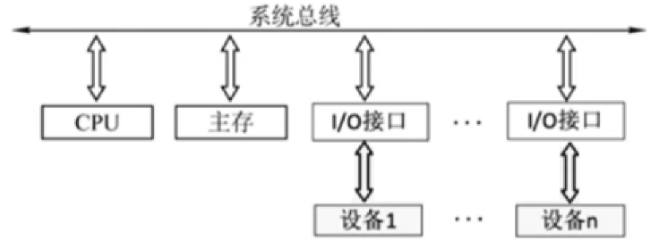

一条系统总线包含数据、地址、控制信号线，cpu可以通过总线直接控制IO接口，也可以让主存与IO接口间传递数据。

例如你敲击键盘上的字母，CPU有两种方式获得数据：

- **程序查询方式**：CPU会不断询问键盘的状态寄存器输入是否完成，如果检测到了完成，就会把数据寄存器里的数据拿到主存。
- **程序中断方式**：CPU不用询问，IO接口根据状态寄存器来选择是否需要向CPU发送一个中断信号，CPU收到信号会过来收取数据。

程序查询方式会导致cpu只能一直等着键盘输入，不能做其他事；程序中断方式可以允许CPU先做其他事，等输入完成后过来取到主存。

有一种特殊的IO接口——**DMA接口**，它可以用DMA总线与主存直接相连，只要CPU告诉DMA接口要把数据存在主存中的哪个地址，DMA接口就会根据地址把数据放进主存。

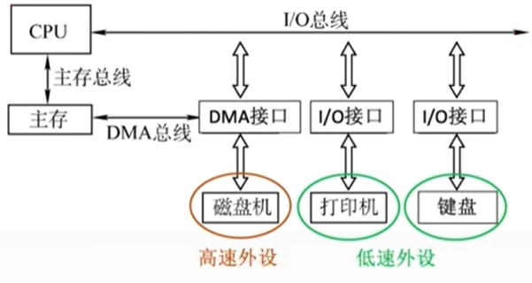

对于DMA接口而言，CPU还需要告诉它主存地址，如果有多个DMA接口，CPU依旧会很忙碌。为了进一步解放CPU，**通道**可以接替CPU做一些基础操作。

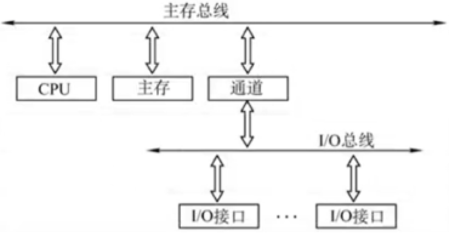

它就像一个低级CPU，有自己的指令系统——通道指令，能够执行一些有限的操作。当它接受到CPU发出的**IO指令**后，可以按照要求启动IO设备，或者执行通道指令——就像是CPU的小弟。

IO指令从逻辑上分为三个字段：

- 操作码：可以被用作和其他指令的区分，让CPU知道这是一条IO指令。
- 命令码：代表了设备要做的具体操作。
- 设备码：可以指定对某个设备进行操作，用作区分设备。

不同设备的IO指令各不相同，同样是设置鼠标侧键、灯光或是灵敏度，不同的品牌都有不同的IO指令。这也是为什么在插上鼠标键盘显卡之类的部件时，如果你想更好的使用它就需要安装驱动的原因。

键盘的每一次敲击都在向计算机发出中断信号，一般情况下计算机会暂停手上的工作，先处理键盘的输入数据，之后再回到自己之前的工作。

这里又引出了很多问题：

**计算机是如何接收到中断信号的？**

计算机内部有许多个中断请求标记寄存器，当设备发出中断信号后会修改这些寄存器的数据，CPU就会知道哪些设备发出了。

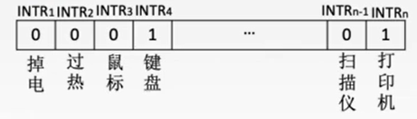

**多个设备同时发出中断信号，计算机应该处理哪个？**

可以用硬件或软件判断哪个中断信号需要优先处理。

硬件：将设备的中断信号看做输出1，可以将设备依次接入电路，越是靠前的电路优先级越高。

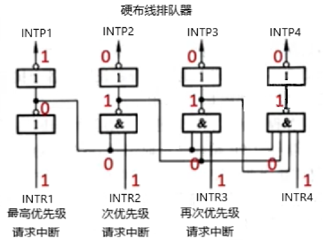

软件：可以写一系列的指令组成**查询程序**，对每个寄存器逐一检查。

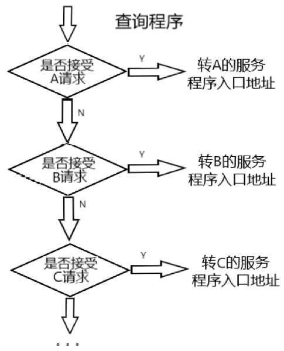

**计算机处理完中断后，如何回到自己的工作？**

计算机在处理中断前，会将当前PC中的指令地址保存，之后将PC中的值修改成中断程序地址——这一操作由**中断隐指令**指挥。处理完成后，再读取保存的指令地址到PC中继续工作。

**如果在处理中断时，又收到中断信号怎么办？**

- 忽视该信号：可在输出电路中加一个**中断屏蔽字信号**，当该设备的屏蔽字输出为1时，屏蔽该设备的中断信号。如果不想接收中断信号，直接把每个设备的屏蔽字都输出1——这个操作称作**关中断**。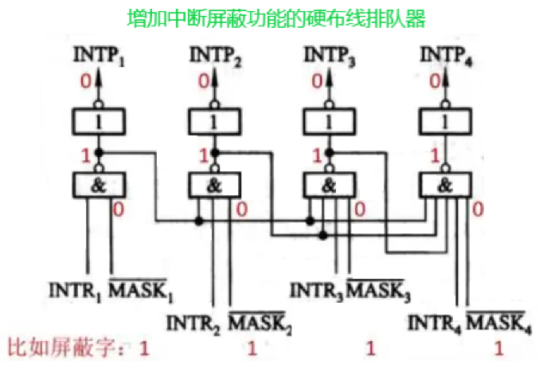
- 再开一个中断程序：就像套娃一般，再一次将当前PC内的值保存后修改。需要注意顺序问题——我们必须要在保存之前先关中断，避免保存动作被打断。保存成功后再**开中断**，接收中断信息。

接下来介绍一个重要的IO设备——机械硬盘，它的工作状态是这样的：

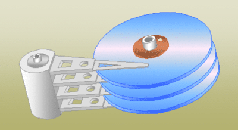

数据存储在磁盘上，用磁头读/写磁盘。其工作原理是：

**磁盘**表面有一层磁性物质，将通电的**磁头**划过磁盘的某个位置后，该位置随机方向的磁极会变的与通电磁头所产生的磁场方向相同。当需要磁头读数据时，磁头会划过一片区域，该区域不同方向的磁极会产生不同方向的感应电流，磁头通过这些微弱的感应电流形成二进制信息。

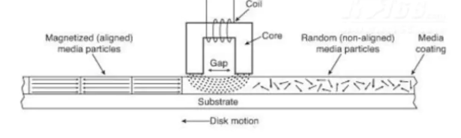

那么问题来了，磁头是如何知道它应该划向哪个区域呢？

首先我们需要知道一共划分成哪些区域：

在磁盘高速旋转，磁头固定不动时，磁头会在磁盘上画出一个圆环，这个圆环是**磁道**，我们通过移动磁头来改变磁道。

将磁盘跟切蛋糕一样分成多个**扇面**，每个扇面中有多个被分割的磁道，每段磁道称为**扇区**——每个扇区大小不一，但存储的数据量相同。

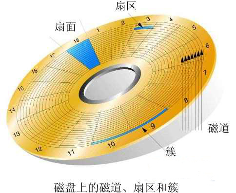

多个磁盘竖向重叠，相同的磁道就组成了一个**柱面**。

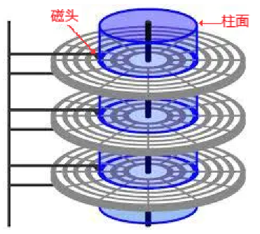

为了能够让磁盘高速旋转，以及摇摆磁头的位置，我们需要**磁盘驱动器**控制磁盘与磁头。

而磁盘驱动器是听从**磁盘控制器**的，磁盘控制器接收计算机发出的指令，指挥磁盘驱动器工作。

计算机发出的指令包括但不限于以下字段：

- 驱动器号：从多个设备中选中一个。

- 柱面（磁道）号：移动磁头到相应磁道。

- 盘面号：选择对应盘面，激活该盘面的磁头。

- 扇区号：旋转磁盘，使得磁头划过相应盘面。

$$
磁盘平均存储时间=磁头移动时间+盘面旋转时间+传输时间
$$

