一位二进制的信息可以用一个电路来保存，而存储器就是将多个电路有序的集中起来，并统一进行输入和输出操作的部件。

如何存储一位信息？

一个电容能存储电荷，可以通过开关来控制：

- 开启，往电容输入电流，可以存储一位信息。
- 开启，如果有电流流出则为1，没有则为0。

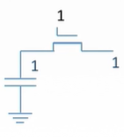

这样能够保存一个二进制位的基本电路叫做**存储元**。

多个存储元拼接成一行，每行称作一个**存储单元**，可以用一根开关线（图为红线）来控制一个存储单元的输出——一个存储元沿着绿线输出信息。

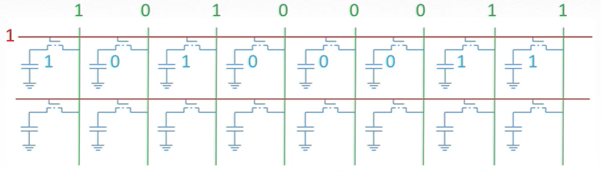

而把多个存储单元拼接起来就组成了一个**存储体**（存储矩阵）。

假设需要读取一行信息，那应该如何从那么多的开关线中，选中我们想要的存储单元呢？

这时候可以引入**译码器**，它通过二进制数转换成具体次序，从而选中具体的开关线。

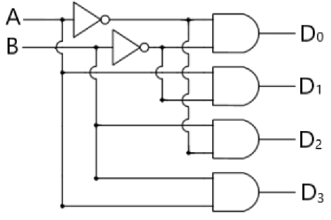

这是一个简单的2-4译码器，我们通过对A、B的输入，就能控制D~0~~D~3~的输出

| 输入A | 输入B | 输出D0 | 输出D1 | 输出D2 | 输出D3 |
| :---: | :---: | :----: | :----: | :----: | :----: |
|   0   |   0   |   0    |   0    |   0    |   1    |
|   0   |   1   |   0    |   0    |   1    |   0    |
|   1   |   0   |   0    |   1    |   0    |   0    |
|   1   |   1   |   1    |   0    |   0    |   0    |

更复杂的译码器也是类似的原理，三根信号线就能控制D~0~~D~7~一共八种输出。当我们有n根信号线时，就能表示2^n^种状态。

例如现在有八个存储单元，我们可以把八条开关线引出来接上译码器，而译码器的另一头只需要三根信号线就可以控制这八根开关线。

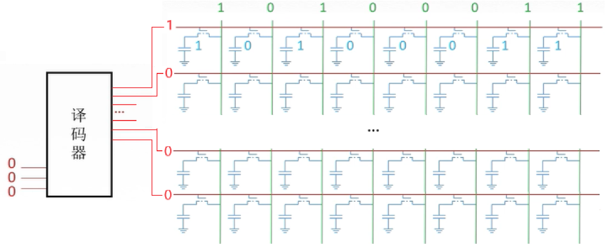

把它封装进一个盒子，一头露出可以输入的**地址寄存器MAR**（Memory Address Register），一头露出可以输出数据的**数据寄存器MDR**（Memory Data Register）。只要给他一个地址，它就能通过译码器找到相应存储地址，并返回一个存储单元大小的数据——一个**存储器芯片**诞生了。

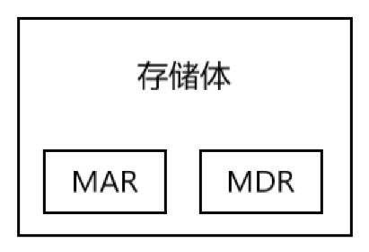

但是这个存储芯片目前还不能写入数据，所以我们可以在芯片中引出一条读/写控制线，例如0是读操作1是写操作。如果是写操作，我们只要对控制线输入1，然后把地址给MAR，数据给MDR，它就能把数据写进相应地址。

一个存储芯片所能存储的容量有限，所以我们需要多个芯片合并使用。为了从多个芯片中选中一个芯片进行读写，我们还需要对每个芯片引入一个“开关线”——就像选中存储单元一样，只不过对芯片的开关线叫做**片选线**。

把以上的所有内容结合起来，就构成了**存储器**的逻辑示意图。

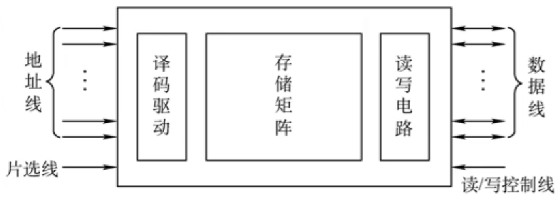

看完这个总览图，让我们把目光转回构成存储体的最小单元——存储元，一开始我们所介绍的简单存储元叫做单管DRAM。用它所做成的存储芯片叫做**动态随机访问存储器 DRAM** (Dynamic Random Access Memory)，它有很多缺点：

- 读取一次数据后，电容里的电就跑出来了，没办法进行第二次读取。

- 电容里的电只能保存很短一段时间（几十微秒），之后就会漏电。

- 断电之后所有的信息都会消失。

我们为了使用它，需要不断对其存储的内容进行重新写入（刷新），保持它所存储的数据。而在对它刷新的同时，是不能对它进行其他读写操作的，所以刷新是比较浪费时间的。

我们把存储元更换成**锁存器**[^1]，它可以保证我们在读取的时候不会破坏存储在里面的数据，并且也不会像DRAM一样过几十微秒就漏电。

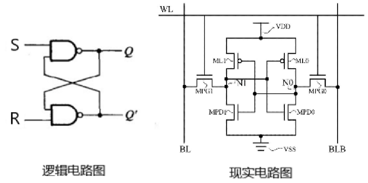

由多个锁存器所构成的存储器叫做**静态随机存取存储器SRAM**（Static Random-Access Memory）。它比DRAM节约了刷新的时间，所以比DRAM速度更快。但是它的结构比DRAM复杂，使用的晶体管数量多，所以在同一单位面积中的存储量比DRAM少，造价高。

锁存器的升级版——**触发器**，它可以根据**时钟CLOCK**来选择是否读写数据。

计算机内部的时钟是用来打节拍的，可以发出稳定频率的电信号。如果此时时钟发出的是高电平，那么触发器就可以被允许修改或输入；如果此时是低电平，则不允许。

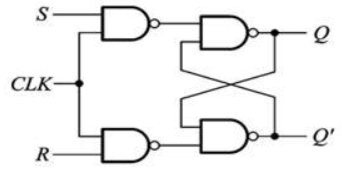

由多个触发器所构成的存储器称为**寄存器**，那我们为什么需要可以被时钟所控制的寄存器呢？

数据相当于水，寄存器相当于蓄水池，ALU与数据线都是水渠，只不过ALU是个可以改变水流的复杂水渠。

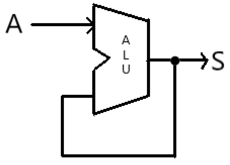

在这个ALU的例子中，想要通过将输出连到ALU的另一个输入达到累加的效果。但是该电路无法控制累加次数，不能保证输出正确。

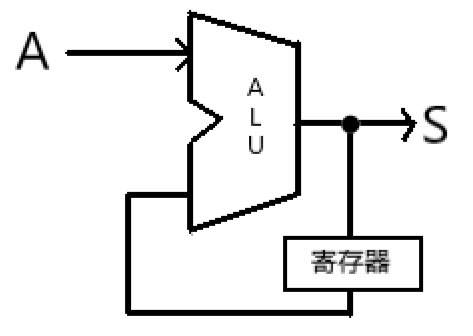

当时钟到达高电平时，输入A通过ALU输出到S，同时寄存器也保存了当前数值A。等下一次时钟又高电平时，打开寄存器，将寄存器的数值释放出来和输入A一起运算。通过时钟对寄存器的“开闸”和“关闭”，就可以保证对ALU的同时输入，从而保证输出的正确。

接下来概述计算机中主要的四种存储器：寄存器，cache，内存，硬盘。

- 你的电脑上有很多软件存在硬盘里，当你打开QQ时，电脑就会把运行QQ的相关数据和程序代码交给内存。
- 如果你调用了QQ的某个功能，例如语音或视频功能，它就会把该功能所需的数据与代码交给cache。
- ALU和寄存器根据cache所给的数据，相互配合运算[^2]。

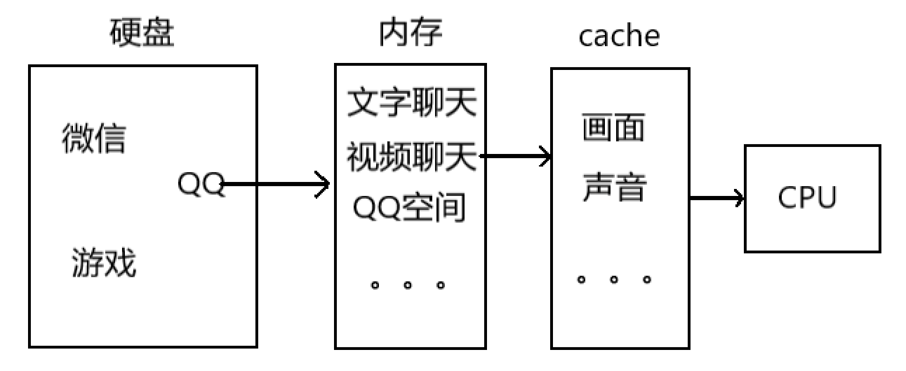

举个例子帮助理解它们之间的关系：

假设你现在在考场上考试，需要完成一份卷子的题目。你会先从多张卷子中选一张卷子出来，然后再从一张卷子中选一道题作答，而作答的过程中需要用到草稿纸。

- 一整份卷子=硬盘

- 一张卷子=内存

- 一道题目=cache

- 草稿纸=寄存器

内存（主存储器）是由DRAM构成，cache（高速缓存）是由SDRAM构成。

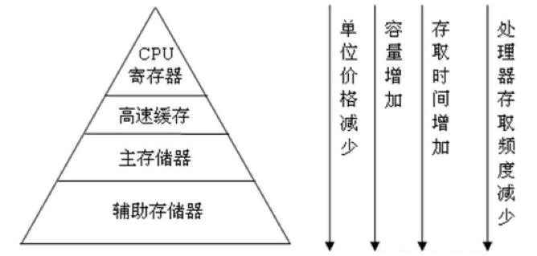

我们为什么需要这么多层次的存储器呢?

主要的原因是数据太多了，而想要在足够小的空间内，存储足够大的数据，就需要付出速度的代价。

容量大的速度慢，速度快的容量小。

所以就导致我们需要用多个存储层次进行层层递进——好在CPU的计算速度不会成为瓶颈，它比存储读取速度要快得多。

[^1]:锁存器的具体工作原理，可以参照：http://t.hk.uy/MhE、http://t.hk.uy/MhF本文由于篇幅有限不再介绍，这里可以直接认为锁存器是一个稳定的存储元。
[^2]:cache其实是在CPU内部的，这里只是为了方便描述。

