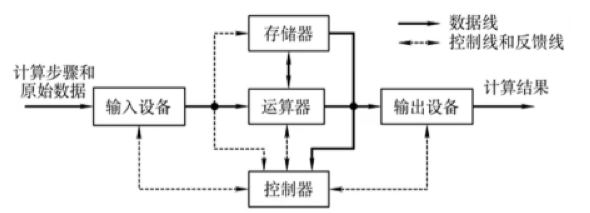
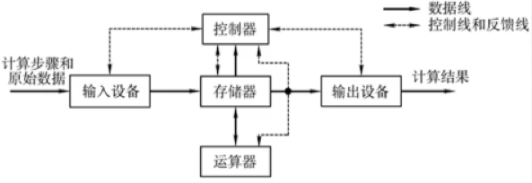
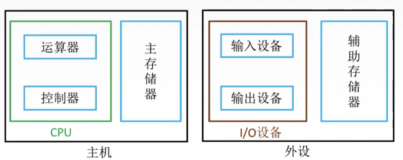

计算机是什么？

它是一个可以帮助我们计算的机器，只要我们能够把计算数据与计算方式“喂”给它，它就能“吐”出我们想要的结果。

键盘、鼠标一类设备是我们用来“喂”给它的**输入设备**。

显示屏、音箱一类设备是它用来“吐”给我们的**输出设备**。

那么这个机器是如何把我们的输入转变为输出的呢？

首先，它有一个叫做**运算器**的东西来帮助我们计算，你可以暂时把运算器当作一个可以加减的黑盒子，只要我们给两个数字和计算方式它就能给出答案。

其次，我们需要一个**控制器**来控制与协调输入设备、运算器、输入设备，让他们知道什么时候读取数据，计算数据，输出数据，不然他们只会傻愣愣的发呆。

最后，我们加一个**存储器**让计算机可以保存数据——这里的数据不光是计算的结果，还有程序（计算的方式）。当我们想要再次运行相同的程序时，就不用重复输入了。

于是我们按照排列顺序得到这样一张示意图：

你会发现这是以运算器为中心的结构，无论是输入还输出都要经过运算器，这样就会占用运算器宝贵的计算时间。我们可以把中心位置替换成存储器，让存储器来承担输入与输出的时间，这样运算器就能更专心的处理运算工作了。

以存储器为中心的示意图：

以上只是逻辑示意图，更主要的是在实际应用当中我们应当如何划分。接下来就把这些转换为实物，搭建一个大致的计算机框架。

通常，人们把运算器和控制器合并在一起，叫做**CPU**（central processing unit，中央处理器），输入、输出设备合并成为**IO**（Input/Output）。

存储器大体分为**内部存储器**和**外部存储器**（或称作主存储器，辅助存储器），大家熟知的内存属于主存储器，硬盘属于辅助存储器。

CPU和主存储器合并称为**主机**，IO与辅助存储器合并称为外设。

这个框架其实并不准确：CPU和主存中间还有一段cache（缓存），CPU自身也带有存储功能的寄存器...后续会详细解释，但这并不影响我们对计算机的初步认识。

至此，计算机的整体框架已经介绍完了，接下来就是对每个部分进行详细解释。