算术逻辑单元ALU是计算机用来进行运算的组件，它是由一系列的简单电路构成。

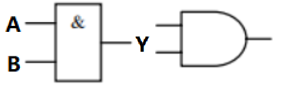

这是与门的电路符号，当A、B输入同时为1时，Y输出1。

|  A   |  B   |  Y   |
| :--: | :--: | :--: |
|  0   |  0   |  0   |
|  1   |  0   |  0   |
|  0   |  1   |  0   |
|  1   |  1   |  1   |

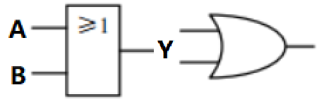

这是或门的电路符号，当A、B其中一个输入为1时，Y输出1。

|  A   |  B   |  Y   |
| :--: | :--: | :--: |
|  0   |  0   |  0   |
|  1   |  0   |  1   |
|  0   |  1   |  1   |
|  1   |  1   |  1   |

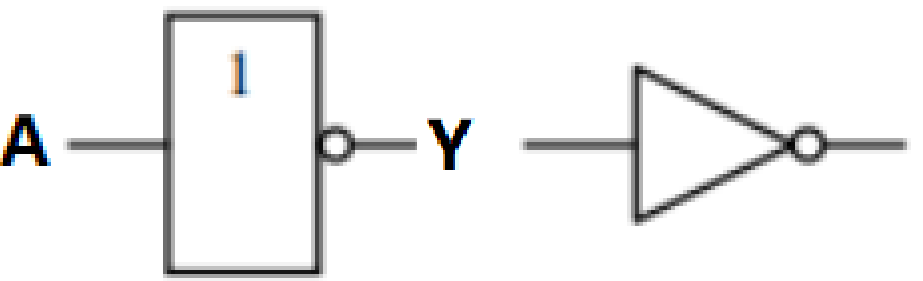

这是非门的电路符号，无论A是什么值，输出总是相反。

|  A   |  Y   |
| :--: | :--: |
|  0   |  1   |
|  1   |  0   |

以上是三个基础逻辑电路，任何复杂的电路都由他们构成。

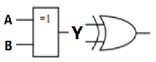

这是异或门的电路符号，只有当A、B输入不相同时，Y输出1。

|  A   |  B   |  Y   |
| :--: | :--: | :--: |
|  0   |  0   |  0   |
|  1   |  0   |  1   |
|  0   |  1   |  1   |
|  1   |  1   |  0   |

异或电路是由与门、与非门（圆圈代表取反）和或门组成。

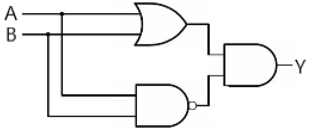

假设现在让你根据以上逻辑门，设计一个只有一位数的简易二进制加法电路，你应该怎么设计呢？

由于异或的特性（相等为0，不等为1），可以保留个位的数值，所以可以把它看做“不进位的加法”。

而与门只有在两个数都为1时为1，其他情况都为0，所以可以得出相加是否进位。

两者结合就能得出一位数的加法的结果。[^1]

> 二进制：1+1=10
>
> 将问题具体化：A，B相加，求出个位（S）与进位（C）

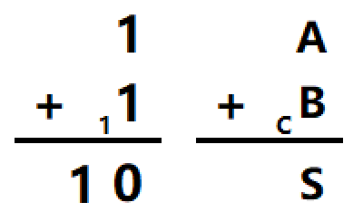
$$
S=A⊕B
$$

$$
C=AB
$$

电路：

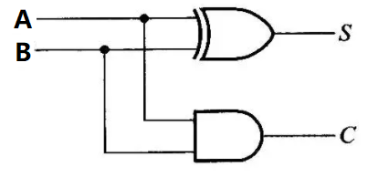

以上便是**一位半加器**。更常见的情况是多位加多位，所以我们在处理一位加一位时，还要再接收来自前一位的进位。

> 二进制：11+11=110
>
> 将问题具体化：本级（Ai，Bi）与前一级进位（Ci-1）相加，求出个位（Si）与进位（Ci）

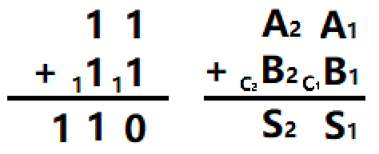

- 个位（S~i~）只要将A~i~，B~i~，C~i-1~这三个数值相互异或就能得出——本质是对三个数进行不进位的相加（C~0~=0）。
- 进位（C~i~）受到两个方面的影响：若仅有Ai与Bi相加就得出进位，则一定进位；若是A~i~与B~i~相加未得出进位，但是A~i~异或B~i~得出的个位再加上C~i-1~可以进位，则一定进位。

$$
S_{i}=A_{i}⊕B_{i}⊕C_{i-1}
$$

$$
C_{i}=A_{i}B_{i}+(A_{i}⊕B_{i})C_{i-1}
$$

电路：

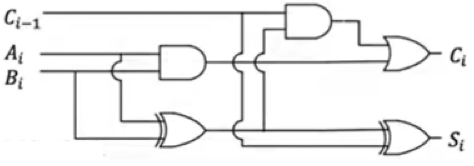

你可以把该电路抽象成一个函数，输入A~i~、B~i~、C~i-1~，输出是S~i~、C~i~，而这就是**一位全加器**FA的逻辑实现步骤。

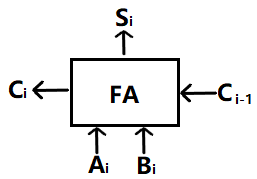

得出一位全加器后，你需要考虑的是如何利用它来实现多位加法

你可以用“进位触发器”将一位全加器的C~i~与C~i-1~相连，这样每次A~i~与B~i~相加后产生的进位都会自动填充，为下一位的计算做准备。

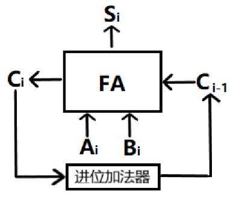

而你需要做的就是不断输入A~i~与B~i~，并记录下相加所产生的S~i~与C~i~。但这样做实在是太低效了，有多少位数就要手动输入多少次。

你可以用多个一位全加器，然后将他们串连——C~i-1~对着C~i~拼在一起，这样就能一次性完成输入并且等待结果了，这就是**串行加法器**[^2]。

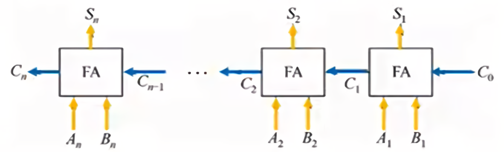

但这样还是有点慢，每一位加法都要等前一位加法算完进位才能继续，最后一个FA要等很久才能参与计算。

回到最初的进位公式，我们可以将C~i~中的C~i-1~不断往下展开：
$$
C_{i}=A_{i}B_{i}+(A_{i}⊕B_{i})C_{i-1}
$$

$$
C_{i}=A_{i}B_{i}+(A_{i}⊕B_{i})(A_{i-1}B_{i-1}+(A_{i-1}⊕B_{i-1})C_{i-2})
$$

$$
C_{i}=A_{i}B_{i}+(A_{i}⊕B_{i})(A_{i-1}B_{i-1}+(A_{i-1}⊕B_{i-1})(A_{i-2}B_{i-2}+(A_{i-2}⊕B_{i-2})C_{i-3}))
$$

当$C_{i-3}~=C_{0}=0$时，你就会发现其中的每一项都是已知条件，无需计算。
$$
令G_{i}=A_{i}B_{i},P_{i}=A_{i}⊕B_{i}
$$

$$
则C_{i}=G_{i}+P_{i}C_{i-1}
$$

$$
C_{i}=G_{i}+P_{i}(G_{i-1}+P_{i-1}C_{i-2})
$$

$$
C_{i}=G_{i}+P_{i}(G_{i-1}+P_{i-1}(G_{i-2}+P_{i-2}C_{i-3}))
$$

而在电路中，红色线为P~i~，绿色线为G~i~

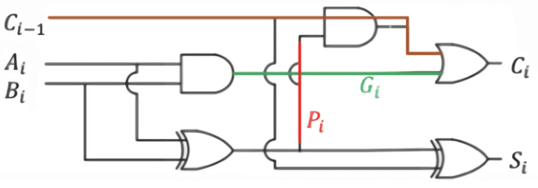

于是我们可以把每个电路中的P~i~，G~i~分别与这个电路之后的每个电路再进行单独的连接。这样每个电路都能从一开始直接获得进位，从而不依赖前一位的计算。

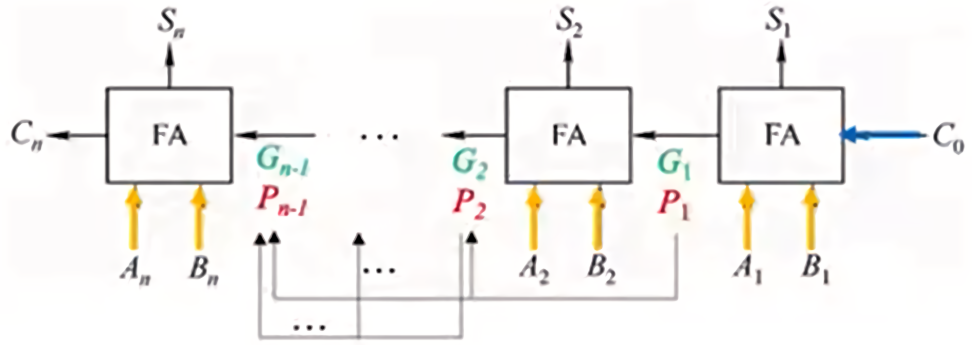

例如有四个一位全加器并行连接：

- 第一个FA的P~1~，G~1~与之后的三个FA每个单独连接
- 第二个FA的P~2~，G~2~与之后的二个FA每个单独连接
- 第三个FA的P~3~，G~3~与之后的一个FA单独连接

于是第四个FA就可以根据P~1~、P~2~、P~3~，G~1~、G~2~、G~3~就能算出所需的进位，不用等第三个FA算进位。同理第三个、第二个FA也不用等待——这就是4位**并行加法器**CLA。

将四个CLA串连，这样就能计算16位的二进制了。然后按照刚刚的方法，把每一个CLA中的P~i~、G~i~都与往后的每一个CLA单独连接…只不过这时电路比较复杂，需要用一个专门的电路把它们集中处理。

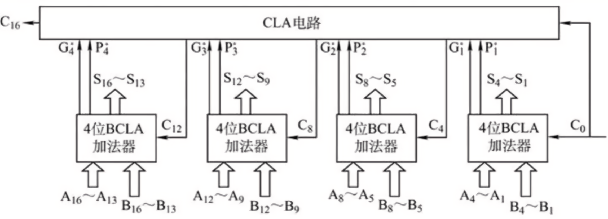

把以上的所有东西封装成一个盒子，你只要对这个盒子输入两个二进制数，它就能返回相加的答案。至此，一个简单的**ALU**（arithmetic and logic unit，算数逻辑单元）就完成了。

但有一个致命的问题，这个ALU怎么算减法？我们需要引入**原码**，**补码**，**取反**以及**模**的概念。

想象一下，面前有一个长度为10cm的软尺头尾相连围成一个圈。

你在刻度9cm的位置，想要移动到刻度7cm有两种选择：

- 后退2cm（减法）
- 往前8cm（加法）

后退和前进之所以能等效，是因为他们的长度（2cm，8cm）合起来等于一个软尺（10cm），相当于绕了一圈。

此时，“2”是原码，“8”是补码，“10”是模，补码“8”可以由模“10”减原码“2”得到[^3]。
$$
(9+(10-2)) mod 10=7
$$
所以我们可以把“减一个原码”转换成“加一个原码的补码，然后扔掉最高位”。但是这个补码本身就需要用“模减原码”来得到，这部分的减法怎么计算？

把上述式子转换成二进制，此时的模可以取$10000$（2^4^，模比原码大即可）：
$$
(1001+(10000-10)) mod 10000=111
$$

$$
\because 10000=1111+1
$$

$$
\therefore(1001+(1111-10+1))mod 10000=111
$$

$1111-10=1101$，结果中的每一位数字都与$0010$相反。因为二进制只有0和1，所以我们可以让计算机把每位0变成1，1变成0，这就是取反（非门）。

所以式子可以简化为：
$$
(1001+(取反+1))扔掉最高位=111
$$
完成了以上内容后，ALU就具有了加减法的功能，我们也可以通过加减法来实现乘除——乘法就是多次的加法，除法就是多次的减法。

但还有许多问题：ALU总要拿数据来计算的，这些数据从哪来？实现乘法需要多次加法，那每次加完之后的结果放在哪？ALU是怎么知道计算的是加法还是减法？...为了更好的完成这颗CPU，我们需要先讨论存储器与指令。

下一篇：RAM存储器

目录

[^1]:逻辑表达式是对电路的数学化描述：与门可以用乘法表示；或门用加法表示；异或门用⊕符号表示http://t.hk.uy/KZj
[^2]:C0默认为0，第一位的前一位进位是空。
[^3]:17÷10=1余7，除数10为模，取模的意思与求余数相同，可以写作17mod10=7